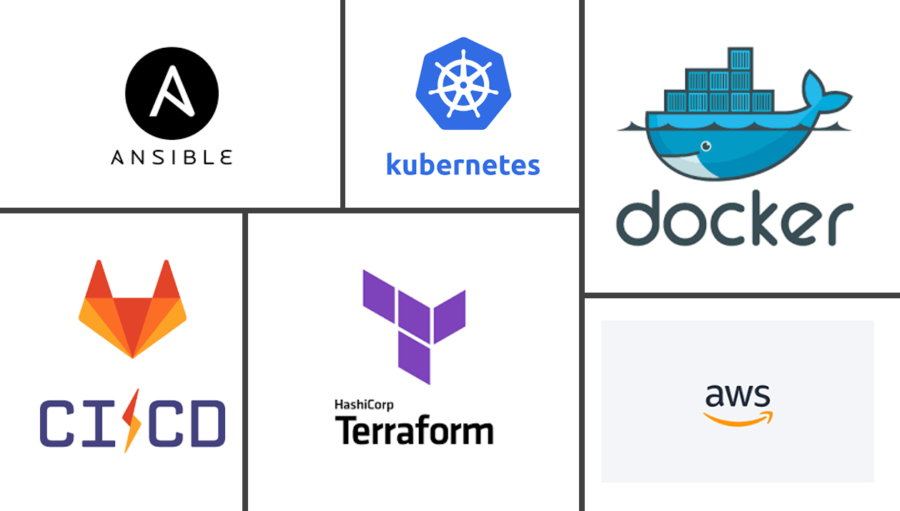

# PROJET FINAL DEVOPS. 

- [PROJET FINAL DEVOPS.](#projet-final-devops)
  - [INTRODUCTION](#introduction)
      - [odoo](#odoo)
      - [pgadmin](#pgadmin)
      - [Liens utiles](#liens-utiles)
  - [**PARTIE 1: Conteneurisation de l’application web**](#partie-1-conteneurisation-de-lapplication-web)
    - [Processus de conteneurisation](#processus-de-conteneurisation)
    - [Nom de l'artefact et registre utilisé](#nom-de-lartefact-et-registre-utilisé)
  - [**PARTIE 2: Mise en place d'un pipeline CI/CD à l'aide de Gitlab-CI et Terraform**](#partie-2-mise-en-place-dun-pipeline-cicd-à-laide-de-gitlab-ci-et-terraform)
    - [a. Infrastructure](#a-infrastructure)
    - [b. Etapes du pipeline CICD](#b-etapes-du-pipeline-cicd)
    - [c. Customisation de la conteneurisation](#c-customisation-de-la-conteneurisation)
  - [**PARTIE 3: Déploiement des différentes applications dans un cluster Kubernetes**](#partie-3-déploiement-des-différentes-applications-dans-un-cluster-kubernetes)
    - [a. Architecture](#a-architecture)
    - [b. Installation de Kubernetes](#b-installation-de-kubernetes)
    - [c. Déploiement de l’application Odoo](#c-déploiement-de-lapplication-odoo)
    - [d. Déploiement de PgAdmin](#d-déploiement-de-pgadmin)
    - [e. Test de fonctionnement et rapport final](#e-test-de-fonctionnement-et-rapport-final)
  - [ANNEXE](#annexe)

## INTRODUCTION

La société **IC GROUP** dans laquelle vous travaillez en tant qu’ingénieur Devops souhaite mettre sur pied un site web vitrine devant permettre d’accéder à ses 02 applications phares qui sont :  

1. Odoo 
2. pgAdmin 
#### odoo
C'est un ERP multi usage qui permet de gérer le système d'information de l'entreprise, nottament les ventes, les achats, la comptabilité, l’inventaire, le personnel, etc …  

Odoo est distribué en version communautaire et Enterprise. ICGROUP souhaite avoir la main sur le code et apporter ses propres modifications et customisations. Ainsi, l'entreprise a opté pour l’édition communautaire.  Plusieurs versions de Odoo sont disponibles et celle retenue est la version ``13.0``, car elle intègre un système de LMS (Learning Management System) qui sera utilisé pour publier les formations en internes et ainsi diffuser plus facilement l’information.  

#### pgadmin
**pgAdmin** devra être utilisée pour administrer de façon graphique la base de données PostgreSQL, qui est un composant essentiel au fonctionnement de odoo. 

#### Liens utiles
- Site officiel de odoo:[ https://www.odoo.com/ ](https://www.odoo.com/) 
- GitHub officiel de odoo:[ https://github.com/odoo/odoo.git ](https://github.com/odoo/odoo.git) 
- Docker Hub officiel de odoo:[ https://hub.docker.com/_/odoo ](https://hub.docker.com/_/odoo) 
- Site officiel de pgadmin:[ https://www.pgadmin.org/ ](https://www.pgadmin.org/) 
- Docker Hub officiel de pgadmin:[ https://hub.docker.com/r/dpage/pgadmin4/ ](https://hub.docker.com/r/dpage/pgadmin4/) 
- Exemple de Pipeline brouillon à améliorer pour vos besoins: https://gitlab.com/Choco92/kandidatapp/
- Mise en place du worker gitlab: https://github.com/gkossi/gitlab-ci-training/tree/main/Lab-1_BUILD et https://www.youtube.com/watch?v=upocyCJMp0g

Le site web vitrine a été conçu par l’équipe de développeurs de l’entreprise et les fichiers y relatifs se trouvent dans le repo suivant: [ https://github.com/sadofrazer/ic-webapp.git ](https://github.com/sadofrazer/ic-webapp.git). Il est de votre responsabilité de conteneuriser cette application tout en permettant la saisie des différentes URL des applications (Odoo et pgadmin) par le biais des variables d’environnement. 

Ci-dessous un aperçu du site vitrine attendu. 

**NB:** L’image créée devra permettre de lancer un conteneur permettant d’héberger ce site web et ayant les liens adéquats permettant d’accéder à aux applications internes 

## **PARTIE 1: Conteneurisation de l’application web**

Il s’agit d’une application web développée en python. Cette application utilise la librairie ``Flask`` de python. 

### Processus de conteneurisation
Voici les étapes à suivre pour la conteneurisation de cette application:

1) L'image de base sera `python:3.6-alpine`
2) Définir le répertoire `/opt` comme répertoire de travail 
3) Installer le module Flask version 1.1.2 à l’aide de `pip install flask==1.1.2`
4) Exposer le port `8080` qui est celui utilisé par défaut par l'application
5) Créer les variables d’environnement `ODOO_URL` et `PGADMIN_URL` afin de permettre la définition des url applicatives lors du lancement du conteneur
6) Lancer l’application `app.py` dans le `ENTRYPOINT` grâce à la commande `python`

Une fois le Dockerfile crée, buildez l'image et lancer un conteneur de test permettant d’aller sur les sites web officiels de chacune de ces applications ( les sites web officiels sont fournis ci-dessus). 

### Nom de l'artefact et registre utilisé
Une fois le test terminé, supprimez le conteneur de test et poussez votre image sur votre registre Docker hub. L'image finale devra se nommer comme suit:

- **Nom:**  ``ic-webapp``   
- **Tag:** ``1.0``  
- **Nom du conteneur de test:** ``test-ic-webapp``

## **PARTIE 2: Mise en place d'un pipeline CI/CD à l'aide de Gitlab-CI et Terraform**

L'entreprise ICGROUP souhaite mettre en place un pipeline CI/CD permettant l'intégration et le déploiement en continu de cette solution sur leurs différentes machines dans différents environnements. L'entreprise étant fan de nouvelles technologies, elle a opté pour Gitlab-CI comme outil de mise en place du Pipeline CICD.

### a. Infrastructure
Pour ce projet, on aura besoin de 3 serveurs hébergées dans le cloud, dont les rôles seront les suivants:

  1) **Serveur 1**, ``(AWS, t2.medium)``: Runner Gitlab-CI
  2) **Serveur 2**, ``(AWS, t2.micro)`` : Serveur de STAGING 
  3) **Serveur 3**, ``(AWS, t2.micro)`` : Serveur de PROD 
Le choix du cloud provider importe peu (AWS, AZURE ou autres ...)
> :warning: Le serveur 1 (**Runner Gitlab-CI**) sera créé manuellement par vos soins pour les besoins de CI. Il devra être rataché à votre compte Gitlab pour en faire votre Runner privé. Quant aux deux autres, il seront créé automatiquement par le pipeline, via l'outil terraform.

### b. Etapes du pipeline CICD

Le Pipeline devra faire les actions suivantes:

 1) Build de l'image ``ic-webapp``
 2) Test de l'image à l'aide des url officielles de odoo et pgadmin
 3) Push de l'image buildée sur dockerhub et votre registre privé  dans gitlab
 4) Création des serveurs de staging et de production dans le cloud
    - Le code terraform permettant de créer vos serveurs devra être présent dans votre dépot gitlab
    - Ce code terraform doit utiliser la notion de modules, afin de variabilisr au maximum votre déploiement.
    - ``Docker`` et ``Docker compose`` doivent être installés sur ces machines
 5) Déploiement des applications sur les deux serveurs de staging et de prod
    - Les applications à déployer sont ``ic-webapp``, ``odoo`` et sa base de donnée ``postgresql``, ``pgadmin``
    - Au déploiement de ic-webapp, ses variables d'envirronnement doivent cette fois ci pointer vers les applications odoo et pgadmin installées par vos soins.
    - Le déploiement doit se faire à l'aide de l'outil ``docker-compose``, celà sous entend que vous devez disposer d'un fichier ``docker-compose.yml`` et le mettre dans votre dépôt gitlab.
 6) Test de fonctionnement permettant de s'assurer que chacune des 3 applications déployées est fonctionnel
 7) Envoie des notifications du Pipeline dans un channel slack

### c. Customisation de la conteneurisation
Afin de davantage automatiser la solution, vous devez créer à la racine de votre dépôt, un fichier appelé ``releases.txt`` dans lequel vous entrerez les données sur l'application, à savoir ``ODOO_URL``, ``PGADMIN_URL`` et ``version``.
Ce fichier devra ressembler à ceci, où version représente le tag de l'image docker:

Par la suite, vous devez modifier votre Dockerfile afin qu’il puisse, lors du build, récupérer les valeurs des URL dans le fichier ``releases.txt`` et les fournir automatiquement en variable d’environnement au conteneur. Il en est de même pour le tag de l'image buildée, qui pourra être récupéré via ce  même mécanisme.
Cela pourrait se faire à l'aide  des commandes ``awk`` et ``export``. Ci-dessous un exemple.

## **PARTIE 3: Déploiement des différentes applications dans un cluster Kubernetes**

### a. Architecture
L'entreprise souhaites à présent migrer ses applications sur cluster ``Kubernetes``, car semblerait -il que cette solution d'orchestration offre plus de possibilité que la solution native de docker, ``docker SWARM``. On se propose donc de donner une amélioration du Pipeline intégrant celà. Les applications pourront être déployées dans le cluster, selon l'architecture suivante:

Etant donné cette architecture logicielle, bien vouloir identifier en donnant le type et le rôle de chacune des ressources (A…H) mentionnées. 

L’ensemble de ces ressources devront être crées dans un namespace particulier appelé ``icgroup``et devront obligatoirement avoir au moins le label ``env = prod``
### b. Installation de Kubernetes
Pour des besoins de facilité, la solution ``Minikube`` sera installée sur vos serveurs de staging et production.
Vous pouvez éventuellement installer un réel serveur Kubernetes si vous vous en sentez capable...
La mise en place du cluster Kubernetes se fera à l'aide d'un playbook ``ansible`` présent dans votre dépot git. Modifiez donc votre pipeline afin d'intégrer ces nouveaux changements.

### c. Déploiement de l’application Odoo

Déployer Odoo à l’aide des images docker correspondantes et assurez vous que les données de la base de données Odoo soient persistantes et sauvegardées dans un répertoire de votre choix sur votre hôte.

### d. Déploiement de PgAdmin

Servez-vous de la documentation de déploiement de PgAdmin sous forme de conteneur afin de déployer votre application dans votre cluster kubernetes. 

> :warning: Le répertoire contenant les données et paramètres de l’application PgAdmin doit être rendu persistant. 

Afin de réduire le nombre de taches manuelles, nous souhaiterons qu’au démarrage de votre conteneur PgAdmin, que ce dernier ait automatiquement les données nécessaires lui permettant de se connecter à votre Base de donnée Odoo. Pour ce faire, il existe un fichier de configuration PgAdmin que vous devrez au préalable customiser et fournir par la suite à votre conteneur/POD sous forme de volume. 

Ce fichier doit être situé au niveau du conteneur dans le répertoire : ``/pgadmin4/servers.json`` 

 ### e. Test de fonctionnement et rapport final

Lancez l’exécution de votre pipeline afin de déployer les différentes applications demandés. Testez le bon fonctionnement de vos différentes applications et n’hésitez pas à prendre des captures d’écran le plus possible afin de consolider votre travail dans un rapport final qui présentera dans les moindre détails ce que vous avez fait. Le rapport doit être élaboré en ``Markdown`` dans votre dépôt git.

 ## ANNEXE

Ci-dessous un exemple de description des qualifications souhaitées pour un poste de Devops 

**NB** : Bien vouloir preter attention aux qualités encadrées en jaune ci-dessus, vous vous rendez compte en effet que maitriser les technologies seulement ne suffit pas, il faut en plus de ca avoir un esprit très créatif, de très bonnes capacités redactionnelles pour rediger vos différents rapports et également des qualités de pédagogue qui vous aideront à parfaire les explications de vos actions dans vos différents rapports afin de faciliter leur compréhension. 

Compte tenu de tout cela, je vous invite tous à donner de l’importance à ce volet « rapport » de votre projet final, car c’est également une partie très importante qui devra pouvoir décrire le contenu de l’ensemble de votre travail.  

Merci de le rédiger correctement avec les captures d’écran, commentaires et explications qui vont bien.
